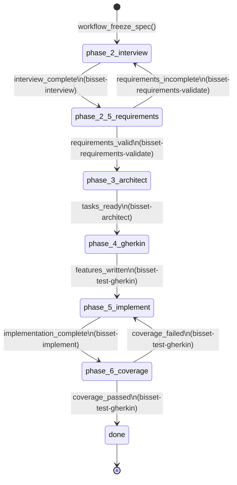

# Bisset MCP

**Bisset** is a workflow orchestration server for AI-assisted software development, exposed as an [MCP](https://modelcontextprotocol.io) tool server. It guides a coding assistant (e.g. GitHub Copilot CLI) through a structured, BDD-first development loop — from requirements interview to executable, verified increments.

## What it does

1. **Requirements interview** — Bisset asks a structured set of questions about the project. The assistant collects answers from the user and records them.
2. **Spec freeze** — answers are locked into a specification document, an ADR stub, and a work breakdown.
3. **Execution loop** — tasks are delivered one at a time. Each task can carry Gherkin acceptance criteria. Bisset writes the `.feature` file to the project repo and, when the assistant calls `workflow_run_tests`, executes the BDD runner itself and stores the results. A task cannot be marked done unless its scenarios pass the coverage threshold (default: 80%).

The assistant speaks to the user in any language. All data written to the workflow database is in English.

## Architecture

```
Copilot CLI (or any MCP client)
        │  STDIO (MCP protocol)
        ▼
  mcp_server  ──HTTP──►  workflow_server  ──SQLite──►  bisset-db/
  (FastMCP)               (FastAPI :8765)
```

- **`mcp_server`** — thin STDIO proxy; exposes all workflow operations as MCP tools and prompts.
- **`workflow_server`** — stateful HTTP backend; owns the SQLite DB, the BDD runner, and all business logic.

## Agent call graph

### Full call graph — all cases

```mermaid
flowchart TD
    User((User)) -->|invokes| bisset

    %% ── Phase 2 ──────────────────────────────────────────────────────────────
    subgraph P2["⬜ Phase 2 — Requirements Interview"]
        bi[bisset-interview]
    end

    %% ── Phase 2.5 ────────────────────────────────────────────────────────────
    subgraph P25["⬜ Phase 2.5 — Requirements Validation"]
        br[bisset-requirements]
        brv[bisset-requirements-validate]
        br -->|Mode 1: validate| brv
    end

    %% ── Phase 3 ──────────────────────────────────────────────────────────────
    subgraph P3["⬜ Phase 3 — Architecture"]
        ba[bisset-architect]
        oop[bisset-architect-oop]
        fn[bisset-architect-functional]
        dod[bisset-architect-dataoriented]
        br2[bisset-requirements]
        ba -->|1 sequential| oop
        ba -->|2 sequential| fn
        ba -->|3 sequential| dod
        ba -->|Mode 2: traceability| br2
    end

    %% ── Phase 4 ──────────────────────────────────────────────────────────────
    subgraph P4["⬜ Phase 4 — Gherkin Generation"]
        btg[bisset-test-gherkin]
    end

    %% ── Phase 5 ──────────────────────────────────────────────────────────────
    subgraph P5["⬜ Phase 5 — Implementation"]
        bim[bisset-implement]
        bback[bisset-backend]
        bfront[bisset-frontend]
        bemb[bisset-embedded]
        bux[bisset-ux]
        bdb[bisset-database]
        bcloud[bisset-cloud]
        bdevops[bisset-devops]
        bdocs[bisset-docs]
        bim -->|per task: domain routing| bback & bfront & bemb & bux & bdb & bcloud & bdevops
        bim -->|all tasks done| bdocs
        bdocs -->|user flows| bux
    end

    %% ── Phase 6 ──────────────────────────────────────────────────────────────
    subgraph P6["⬜ Phase 6 — Coverage Gate"]
        btg2[bisset-test-gherkin]
    end

    %% ── Review ───────────────────────────────────────────────────────────────
    subgraph REV["⬜ Review — any time"]
        brev[bisset-review]
        br3[bisset-requirements]
        bre[bisset-requirements-extract]
        brev -->|no requirements found| br3
        br3 -->|Mode 3: extraction| bre
    end

    %% ── bisset → phases ──────────────────────────────────────────────────────
    bisset -->|phase_2_interview| bi
    bisset -->|phase_2_5_requirements| br
    bisset -->|phase_3_architect| ba
    bisset -->|phase_4_gherkin| btg
    bisset -->|phase_5_implement| bim
    bisset -->|phase_6_coverage| btg2
    bisset -->|user request| brev

    %% ── signals back to bisset ───────────────────────────────────────────────
    bi -->|interview_complete| bisset
    brv -->|requirements_valid| bisset
    brv -->|requirements_incomplete| bisset
    ba -->|tasks_ready| bisset
    btg -->|features_written| bisset
    bim -->|implementation_complete| bisset
    brev -->|report complete| bisset

    %% ── loops ────────────────────────────────────────────────────────────────
    bisset -->|"⟳ requirements_incomplete"| bi
    btg2 -->|"⟳ coverage_failed → phase_5_implement"| bim
    btg2 -->|coverage_passed ✓| DONE((✅ done))
```



### Sub-phase state machine



### Phase sequence

```
Phase 1   → bisset           session creation
Phase 2   → bisset-interview requirements interview
Phase 2.5 → bisset-requirements validate completeness / consistency / testability
              └─ requirements_incomplete → loop back to Phase 2
Phase 3   → bisset-architect  evaluate OOP / Functional / Data-Oriented proposals
              ├─ bisset-architect-{oop,functional,dataoriented}  produce proposals
              │    ⚠️  these 3 sub-agents run sequentially (Copilot CLI limitation — no
              │        native parallelism). Phase 3 takes ~3× longer than other phases.
              │        If time is critical, a human operator can run the three agents
              │        manually in separate sessions and paste proposals into the chat.
              └─ bisset-requirements  cross-check architectural coverage
Phase 4   → bisset-test-gherkin  generate {task}.feature + {task}.negative.feature
Phase 5   → bisset-implement  implement task by task via domain specialists
              ├─ bisset-{backend,frontend,embedded,ux,database,cloud,devops}
              └─ bisset-docs  update README, API ref, flows, architecture docs
                   └─ bisset-ux  document user flows and interaction specs
Phase 6   → bisset-test-gherkin  run full BDD suite, gate on > 80% coverage
              └─ coverage_failed → loop back to Phase 5
Review    → bisset-review     conformance audit (any time)
              └─ no requirements? → bisset-requirements extracts them from code
```

### Agent table

| Agent | Phase | user-invocable | Parent | Key tools |
|---|---|---|---|---|
| `bisset` | dispatcher | ✅ | — | agent, workflow_get_state |
| `bisset-interview` | 2 | ❌ | bisset | workflow tools |
| `bisset-requirements` | 2.5 / 3 / review | ❌ | bisset, bisset-architect, bisset-review | agent |
| `bisset-requirements-validate` | 2.5 | ❌ | bisset-requirements | workflow_advance_phase |
| `bisset-requirements-extract` | review | ❌ | bisset-requirements | workflow_store_proposal |
| `bisset-architect` | 3 | ❌ | bisset | agent, workflow_advance_phase, workflow_list_proposals |
| `bisset-architect-oop` | 3 | ❌ | bisset-architect | workflow_store_proposal |
| `bisset-architect-functional` | 3 | ❌ | bisset-architect | workflow_store_proposal |
| `bisset-architect-dataoriented` | 3 | ❌ | bisset-architect | workflow_store_proposal |
| `bisset-test-gherkin` | 4, 6 | ❌ | bisset | workflow_advance_phase, workflow_add_task |
| `bisset-implement` | 5 | ❌ | bisset | agent, workflow_advance_phase, workflow_run_tests |
| `bisset-backend` | 5 | ❌ | bisset-implement | read, edit, execute |
| `bisset-frontend` | 5 | ❌ | bisset-implement | read, edit, execute |
| `bisset-embedded` | 5 | ❌ | bisset-implement | read, edit, execute |
| `bisset-ux` | 5 | ❌ | bisset-implement, bisset-docs | read, edit |
| `bisset-docs` | 5 | ❌ | bisset-implement | agent, read, edit, search |
| `bisset-database` | 5 | ❌ | bisset-implement | read, edit, execute |
| `bisset-cloud` | 5 | ❌ | bisset-implement | read, edit, execute |
| `bisset-devops` | 5 | ❌ | bisset-implement | read, edit, execute |
| `bisset-review` | any | ❌ | bisset | agent, execute, workflow_list_tasks |

## Tools exposed to the assistant

| Tool | Description |
|------|-------------|
| `workflow_new_session` | Create a new project session |
| `workflow_switch_session` | Switch to an existing session |
| `workflow_start` | Seed the question catalog and begin the interview |
| `workflow_next_question` | Get the next unanswered question |
| `workflow_record_answer` | Record an answer |
| `workflow_freeze_spec` | Lock the spec and generate work breakdown (blocks if `project_path` missing) |
| `workflow_advance_phase` | Emit a signal to advance the workflow sub-phase |
| `workflow_next_task` | Get the current pending task (with Gherkin criteria) |
| `workflow_add_task` | Add a project-specific task with Gherkin acceptance criteria |
| `workflow_run_tests` | **Bisset runs the BDD tests** — structured output: `returncode`, `duration_ms`, `tests_passed`, `tests_failed`, `output_log_path` |
| `workflow_accept_task_result` | Mark a task done (gated on test results) |
| `workflow_list_tasks` | List all tasks and their status |
| `workflow_list_questions` | List all questions and answers |
| `workflow_list_sessions` | List all sessions |
| `workflow_report` | Summary of current phase and progress |
| `workflow_is_done` | Check if all tasks are complete |
| `workflow_store_proposal` | Persist an architecture proposal for the session |
| `workflow_list_proposals` | Retrieve stored architecture proposals |
| `workflow_status` | **Rich introspection** — phase, sub_phase, current_task, tasks_done/total, last_error in one call |
| `workflow_bootstrap_project` | **Auto-detect** project type from a directory — sets `test_runner`, `features_dir`, `project_path` |
| `workflow_run_until_blocked` | **Autonomous loop** — runs the full implement→test→accept cycle until blocked, done, or budget exhausted |
| `workflow_get_events` | Return the execution event log for debug, audit, and crash recovery |

## BDD enforcement

When a task has `acceptance_criteria`:

1. `workflow_add_task` writes `{project_path}/features/{task_id}.feature` automatically.
2. The assistant implements the feature.
3. `workflow_run_tests(task_id)` — Bisset executes the configured runner (`pytest`, `behave`, etc.) in `project_path` and stores pass/fail counts. The assistant has no input path into results.
4. `workflow_accept_task_result` is **blocked** unless a passing run exists in the DB with `coverage_pct >= bdd_coverage_threshold` (default 80%).

See [`docs/bdd-enforcement.md`](docs/bdd-enforcement.md) for full design.

## Quick start

```bash
# 1. Install dependencies
cd orchestrator
pip install -r workflow_server/requirements.txt

# 2. Start the workflow server
python -m orchestrator.workflow_server

# 3. Start the MCP server (in a separate terminal or via your MCP client config)
python -m orchestrator.mcp_server
```

Or use the provided script:

```bash
./start.sh
```

### MCP client configuration (Copilot CLI)

```json
{
  "mcpServers": {
    "bisset": {
      "command": "python",
      "args": ["-m", "orchestrator.mcp_server"],
      "cwd": "/path/to/BissetMCP"
    }
  }
}
```

### Project meta (BDD runner config)

Pass these in `workflow_start` to enable BDD enforcement:

```json
{
  "name": "MyProject",
  "project_path": "/absolute/path/to/project",
  "features_dir": "features",
  "test_runner": "pytest",
  "test_runner_args": ["--tb=short", "-q"],
  "bdd_coverage_threshold": 80,
  "use_line_coverage": true,
  "line_coverage_threshold": 80
}
```

**Tip:** Instead of filling this manually, call `workflow_bootstrap_project(cwd="/path/to/project")` first — it auto-detects the test runner and features directory.

## Autonomous workflow (autopilot mode)

Bisset supports fully autonomous operation via the `workflow_run_until_blocked` macro tool.
The LLM triggers a single tool call; Bisset owns the inner loop.

```
workflow_bootstrap_project(cwd=".")
workflow_new_session(name="MyProject")
workflow_start(project_meta={...})              # interview questions answered by bisset-interview
workflow_freeze_spec()                          # after all questions answered
# ... requirements, architect, gherkin phases ...
workflow_run_until_blocked(max_iterations=20)   # ← autonomous implementation loop
```

`workflow_run_until_blocked` returns one of:

| `status` | Meaning | Next action |
|---|---|---|
| `done` | All tasks accepted | Done! Call `workflow_is_done()` |
| `blocked` | Test failure or config error | Read `fix` field; fix the code; retry |
| `timeout` | Wall-clock budget exceeded | Increase `max_minutes` or retry |
| `iteration_limit` | Max iterations reached | Increase `max_iterations` or retry |

For debugging any failure, call `workflow_get_events(limit=20)` to see a full audit trail of every tool invocation.

## Running tests

```bash
pytest features/ --ignore=features/steps/test_mcp_stdio.py
```

## Repository layout

```
orchestrator/
  mcp_server/         # STDIO MCP proxy
  workflow_server/    # FastAPI backend
    app.py            # HTTP endpoints + prompts
    engine.py         # business logic
    storage.py        # SQLite persistence
    catalog.py        # default questions + tasks
    renderers.py      # spec/plan/feature file writers
docs/
  architecture.md
  bdd-enforcement.md
features/             # BDD tests for Bisset itself
```

## License

GNU General Public License v3.0 — see [LICENSE](LICENSE).
