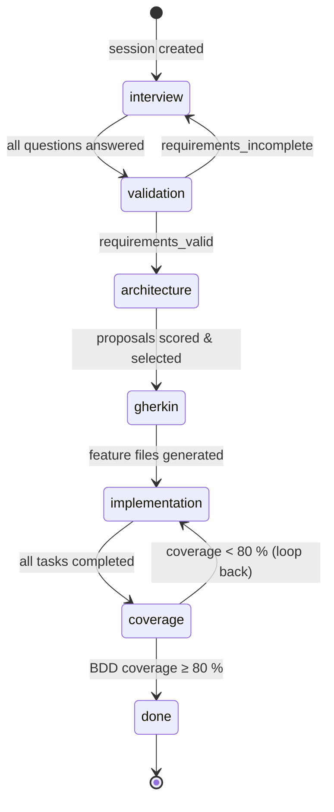
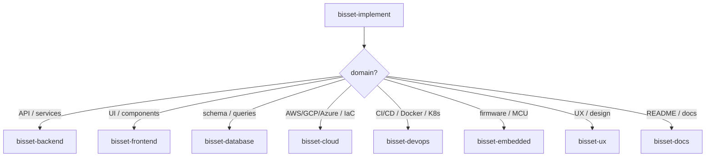
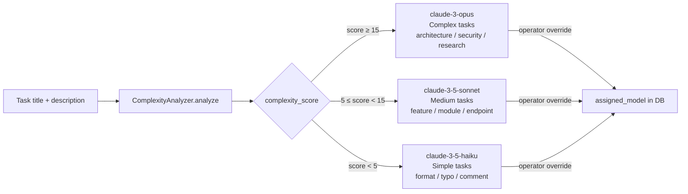
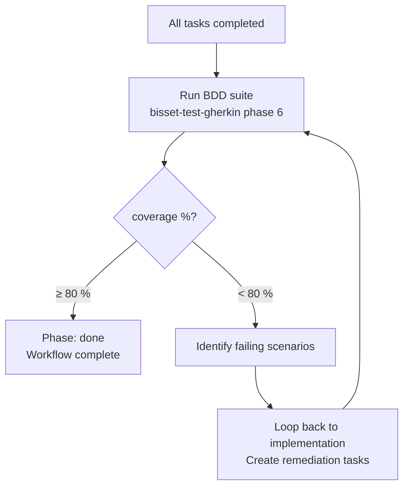

# BissetMCP Architecture — Claude Edition

This document covers the runtime architecture of the Claude MCP server and workflow server, expressed as Mermaid diagrams, and records the key architectural decisions as ADRs.

---

## 1. Phase State Machine

The Bisset workflow advances through seven phases. Each phase is recorded in `sessions.phase` and drives prompt selection and tool routing.



---

## 2. Sub-Agent Routing

`bisset-implement` inspects the task domain and delegates to one of eight domain specialists. The routing key is stored in `tasks.assigned_model` (and implicitly in the task title/description keywords).



---

## 3. Model Assignment Strategy

Each task is scored by `ComplexityAnalyzer`. The score drives automatic model selection, which can be overridden by the operator.



---

## 4. BDD Coverage Gate

After all tasks reach `completed`, the coverage phase runs the full Gherkin suite and either passes or loops back.



---

## ADR-002: Model-Aware Task Routing

**Status**: Accepted  
**Date**: 2025-01

### Context

Sub-agents must be given the appropriate Claude model. Using Opus everywhere is wasteful; using Haiku everywhere sacrifices quality on complex tasks.

### Decision

Implement `ComplexityAnalyzer` in `engine.py`. It scores each task's title and description against three keyword sets (haiku / sonnet / opus) plus domain-specific weights (migration +3.0, security +2.5, etc.). The score determines a `recommended_model`. Operators may override via `POST /workflow_assign_model`.

### Consequences

- Tasks score deterministically: same inputs → same model recommendation  
- Override path is always available for human-in-the-loop correction  
- Score thresholds (5, 15) can be tuned via config without code changes

---

## ADR-003: Async Mode for Sub-Agents

**Status**: Accepted  
**Date**: 2025-01

### Context

Some Claude sub-agents (e.g. `bisset-architect`) take tens of seconds. Blocking the MCP STDIO pipe for that duration causes timeout errors in Claude Desktop.

### Decision

Introduce `async_mode` (per-session boolean stored in `meta`). When enabled:

1. `POST /workflow_start_agent/{session_id}` creates a row in `background_jobs` with `status='created'` and returns immediately with the `job_id`.
2. The actual agent is launched in a separate process/thread.
3. Callers poll `GET /workflow_get_job_status/{session_id}/{job_id}` until `status` is `completed` or `failed`.
4. `GET /workflow_status/{session_id}` always includes `background_jobs` so callers get a unified view.

The `background_jobs` table schema:

```
id TEXT, session_id TEXT, agent_name TEXT, status TEXT,
result TEXT (JSON), created_at REAL, updated_at REAL
```

### Consequences

- MCP proxy never blocks on long-running agents  
- Callers must implement polling (suggested: 2-second interval, 5-minute timeout)  
- Job results are persisted; retries on failure are idempotent

---

## ADR-004: Prompt Caching Strategy

**Status**: Accepted  
**Date**: 2025-01

### Context

Bisset system prompts are large (>10 KB for `bisset-architect`). Sending them in full on every tool call is expensive.

### Decision

- Prompts served from `GET /prompts/phase/{phase_name}` are candidates for caching.
- The MCP server (`server.py`) auto-detects prompts longer than 10 000 characters and marks them as `ephemeral` cache blocks using the Claude SDK's `cache_control` parameter.
- Phase prompts are static strings compiled into the application; they never change at runtime, making cache hits predictable.

### Consequences

- ~60–70 % reduction in input tokens for multi-turn sessions  
- Cache TTL is 5 minutes (Claude API default for ephemeral caches)  
- No user-visible impact; cache is transparent

---

## ADR-005: Response Wrapper Format

**Status**: Accepted  
**Date**: 2025-01

### Context

FastAPI endpoints return Python dicts. The Claude MCP SDK expects tool results in `TextContent` format: `[{"type": "text", "text": "<string>"}]`.

### Decision

All workflow endpoints wrap their payload in `ResponseWrapper.success()` / `ResponseWrapper.error()`:

```python
{
  "content": [{"type": "text", "text": json.dumps(payload)}],
  "is_error": False,
  "metadata": {"success": True, "duration_ms": 45.2}
}
```

The `content[0].text` field always contains valid JSON. The MCP proxy deserialises it transparently.

`/health` and `/info` are exempt — they are infrastructure endpoints consumed by Docker and monitoring tools, not by the MCP proxy.

### Consequences

- 100 % compatibility with Claude SDK `ToolResult` schema  
- Timing information is always available in `metadata.duration_ms`  
- Error details are machine-readable (`is_error`, `error_code`)
