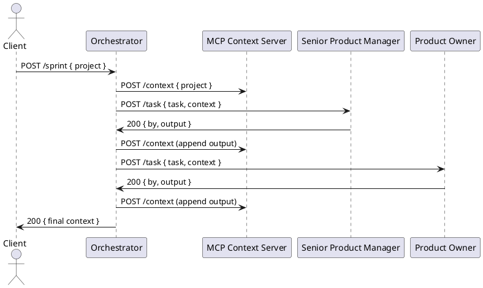

# BissetMCP — Detailed Architecture

## Purpose
Define components, API contracts, and diagrams for the BissetMCP project: MCP Context Server, Orchestrator, and agents. This document serves as a reference specification for implementation, testing, and deployment.

## Main Components

- MCP Context Server (Node.js/Express)
  - Port: 3000
  - In-memory store responsible for the sprint context
  - Main endpoints:
    - GET /context -> { project, tasks[] }
    - POST /context -> overwrites the context
    - DELETE /context -> reset
    - GET /health -> { status: "ok" }

- Orchestrator (Flask/Python)
  - Port: 8080
  - Main endpoints:
    - POST /dispatch { agent: "sw-architect", task: {...} } -> dispatch to a single agent
    - POST /sprint { project: "..." } -> runs a sequential agent pipeline
    - GET /health -> { status: "ok" }

- Agents (HTTP microservices)
  - Each agent exposes POST /task which receives { task, context }
  - Must return 200 with body { by: "Agent Name", task: {...}, output: "# Markdown..." }
  - Health check: GET /health

## API Contracts (examples)

MCP Context Server

- GET /context
  Response 200:
  {
    "project": "Description...",
    "tasks": [ { "by": "Senior PM", "task": {...}, "output": "#..." }, ... ]
  }

- POST /context
  Request 200: body = entire JSON context (overwrites)

Orchestrator -> Agent (POST /task)

Request body:
{
  "task": { "id": "t1", "action": "Produce product backlog", "project": "..." },
  "context": { /* current output of the MCP context server */ }
}

Response 200:
{
  "by": "Product Owner",
  "task": { "id": "t1", ... },
  "output": "# Product Backlog\n- User story 1..."
}

## Context Format (JSON schema)

{
  "project": "string",
  "tasks": [
    {
      "by": "string",
      "task": { "id": "string", "action": "string", ... },
      "output": "string (markdown)",
      "meta": { "timestamp": "ISO8601", "agent_version": "string" }
    }
  ]
}

## Sequence: /sprint execution (simplified)

1. Client POST /sprint { project }
2. Orchestrator POST /context -> initialize context with project
3. Orchestrator sequentially for each agent:
   - POST to agent /task with current context
   - Agent returns output
   - Orchestrator POST /context with appended task output
4. Upon completion, Orchestrator returns aggregated context and artifacts

## Separation Between MCP Server and Execution Backend

To allow iterative development of the system (for example, changes made via Copilot CLI), a clear separation is planned between:

- MCP Context Server: a service that exposes APIs to read/overwrite the sprint context and acts as a bridge to Copilot sessions. It exposes public endpoints used by the CLI (e.g., /context, /health) and supports hooks or additional endpoints for synchronization with a remote development session.

- Execution Backend: a separate service responsible for executing commands, updating the repository, and performing destructive operations (e.g., git commit, build, deploy). It communicates with the Orchestrator and agents via protected APIs but does not directly expose the context to the CLI.

Example flow for development via Copilot CLI:

1. The developer uses Copilot CLI to send a modification/update request to the MCP Context Server (e.g., "update agent stub X").
2. MCP Context Server validates the request and stores it in the context (e.g., as a task with 'pending-change' status).
3. The Execution Backend polls or receives a webhook from the MCP Server for 'pending-change' type tasks.
4. The Execution Backend performs actions on the source code (apply patch, git commit, run tests) in a controlled environment and reports the status/result back to the MCP Server.
5. Copilot CLI can query the MCP Server to see the status of changes and the results of commands executed by the Backend.

Security and considerations:
- Communication between Copilot CLI and MCP Server can be authenticated via temporary tokens.
- The Execution Backend should expose APIs only on an internal or protected network and accept requests signed by the MCP Server (HMAC).
- Maintain an audit trail of actions performed by the Backend in the context (audit entries in context.tasks.meta).

## PlantUML Diagram (example)

## Deployment
- Docker Compose will orchestrate: mcp-server, orchestrator, agent-stubs
- Environment variables for ports and LLM configurations (API keys) not committed

## Considerations and Next Steps
- Version the context schema (v1, v2)
- Add optional authentication between Orchestrator and agents (HMAC) for security
- Define E2E tests that validate the /sprint pipeline
