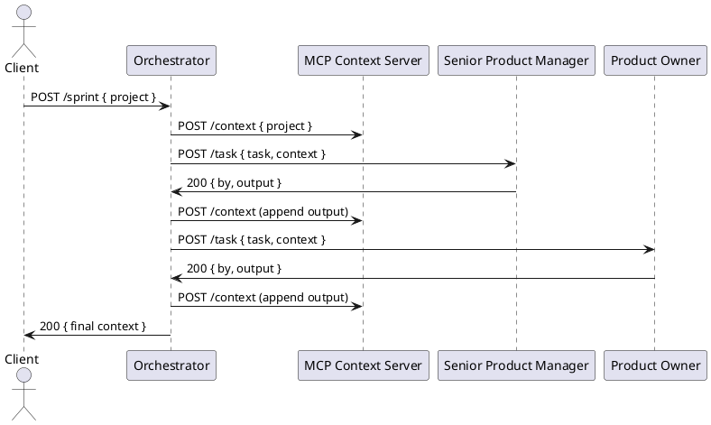

# BissetMCP — Architettura dettagliata

## Scopo
Definire componenti, contratti API e diagrammi per il progetto BissetMCP: MCP Context Server, Orchestrator e agenti. Questo documento funge da specifica di riferimento per implementazione, test e deploy.

## Componenti principali

- MCP Context Server (Node.js/Express)
  - Porta: 3000
  - In-memory store responsabile del contesto dello sprint
  - Endpoints principali:
    - GET /context -> { project, tasks[] }
    - POST /context -> sovrascrive il contesto
    - DELETE /context -> reset
    - GET /health -> { status: "ok" }

- Orchestrator (Flask/Python)
  - Porta: 8080
  - Endpoints principali:
    - POST /dispatch { agent: "sw-architect", task: {...} } -> dispatch verso singolo agente
    - POST /sprint { project: "..." } -> esegue pipeline sequenziale di agenti
    - GET /health -> { status: "ok" }

- Agenti (microservizi HTTP)
  - Ogni agente espone POST /task che riceve { task, context }
  - Deve restituire 200 con body { by: "Agent Name", task: {...}, output: "# Markdown..." }
  - Health check: GET /health

## Contratti API (esempi)

MCP Context Server

- GET /context
  Response 200:
  {
    "project": "Descrizione...",
    "tasks": [ { "by": "Senior PM", "task": {...}, "output": "#..." }, ... ]
  }

- POST /context
  Request 200: body = intero contesto JSON (sovrascrive)

Orchestrator -> Agent (POST /task)

Request body:
{
  "task": { "id": "t1", "action": "Produce product backlog", "project": "..." },
  "context": { /* output corrente del MCP context server */ }
}

Response 200:
{
  "by": "Product Owner",
  "task": { "id": "t1", ... },
  "output": "# Product Backlog\n- User story 1..."
}

## Formato del contesto (schema JSON)

{
  "project": "string",
  "tasks": [
    {
      "by": "string",
      "task": { "id": "string", "action": "string", ... },
      "output": "string (markdown)",
      "meta": { "timestamp": "ISO8601", "agent_version": "string" }
    }
  ]
}

## Sequenza: esecuzione /sprint (semplificata)

1. Client POST /sprint { project }
2. Orchestrator POST /context -> initialize context with project
3. Orchestrator sequentially for each agent:
   - POST to agent /task with current context
   - Agent returns output
   - Orchestrator POST /context with appended task output
4. Al termine, Orchestrator returns aggregated context and artifacts

## Separazione tra MCP Server e Backend esecutivo

Per permettere lo sviluppo iterativo del sistema (ad esempio modifiche eseguite tramite Copilot CLI) è prevista una separazione chiara tra:

- MCP Context Server: servizio che espone API per leggere/sovrascrivere il contesto dello sprint e che funge da ponte verso le sessioni Copilot. Espone endpoint pubblici usati dal CLI (es. /context, /health) e supporta hook o endpoint aggiuntivi per sincronizzazione con sessione di sviluppo remota.

- Execution Backend (Backend esecutivo): servizio separato responsabile dell'esecuzione di comandi, aggiornamento del repository e operazioni distruttive (es. git commit, build, deploy). Comunica con l'Orchestrator e gli agenti tramite API protette, ma non espone direttamente il contesto al CLI.

Flusso di esempio per sviluppo tramite Copilot CLI:

1. Lo sviluppatore usa la Copilot CLI per inviare una richiesta di modifica/aggiornamento al MCP Context Server (es. "aggiorna agent stub X").
2. MCP Context Server valida la richiesta e la memorizza nel contesto (es. come task con stato di 'pending-change').
3. Il Backend esecutivo polla o riceve webhook dal MCP Server per task di tipo 'pending-change'.
4. Backend esecutivo esegue azioni sul codice sorgente (apply patch, git commit, run tests) in un ambiente controllato e riporta lo stato/risultato al MCP Server.
5. Copilot CLI può interrogare il MCP Server per vedere lo stato delle modifiche e i risultati dei comandi eseguiti dal Backend.

Sicurezza e considerazioni:
- Comunicazione tra Copilot CLI e MCP Server può essere autenticata tramite token temporanei.
- Backend esecutivo dovrebbe esporre API solo in rete interna o protetta e accettare richieste firmate dall'MCP Server (HMAC).
- Tenere un audit trail delle azioni eseguite dal Backend nel contesto (audit entries nel context.tasks.meta).

## Diagramma PlantUML (esempio)

## Deployment
- Docker Compose orchestrerà: mcp-server, orchestrator, agent-stubs
- Variabili d'env per porte e configurazioni LLM (API keys) non commitate

## Considerazioni e prossimi passi
- Versionare lo schema del contesto (v1, v2)
- Aggiungere autenticazione opzionale tra Orchestrator e agenti (HMAC) per sicurezza
- Definire test E2E che validino la pipeline /sprint

